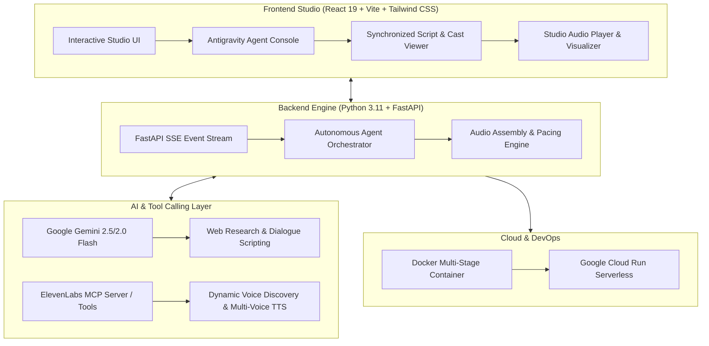

Here is the complete **Technical Stack** for **Narrata**, formatted and ready for your **Devpost Submission**, architecture slides, and project documentation:

---

# 🛠️ Narrata — Technical Stack Breakdown

---

## 1. 🧠 AI Reasoning, Agent Orchestration & LLM Layer

| Technology | Role in Narrata |
| :--- | :--- |
| **Google Gemini 2.5 / 2.0 (via Google GenAI SDK)** | Powers the core reasoning, web research grounding, multi-speaker screenwriting, emotional inflection tagging, and voice persona matching. |
| **Vertex AI Agent Builder / ADK Pattern** | Orchestrates the multi-step autonomous agent lifecycle (Plan $\rightarrow$ Script $\rightarrow$ Cast $\rightarrow$ Synthesize $\rightarrow$ Assemble). |
| **Model Context Protocol (MCP)** | Standardized protocol allowing the agent to discover and invoke ElevenLabs partner tools dynamically at runtime. |
| **Structured JSON Schema Enforcement** | Guarantees deterministic, strongly-typed outputs for outlines, character profiles, dialogue lines, and pause timings. |

---

## 2. 🎙️ Voice Synthesis & Partner MCP Integration

| Technology | Role in Narrata |
| :--- | :--- |
| **ElevenLabs MCP Server & Tools** | Executes `elevenlabs__list_voices` to query the live voice catalog and `elevenlabs__text_to_speech` for audio generation. |
| **Dynamic Voice Casting Engine** | Matches character personas to optimal voices based on gender, accent, age, tone, and character disposition (zero hardcoded voice IDs). |
| **Custom Audio Stitching & Pacing Engine** | Pure-Python audio assembler that splices individual speaker MP3 buffers, injects realistic silence pauses, and calculates synchronized timeline metadata. |

---

## 3. ⚡ Backend Architecture

| Technology | Role in Narrata |
| :--- | :--- |
| **Python 3.11+** | Core runtime environment. |
| **FastAPI** | High-performance asynchronous backend framework handling REST APIs and static file mounting. |
| **Server-Sent Events (SSE)** | Real-time bi-directional streaming of agent thoughts, live MCP tool call payloads, and synthesis progress to the UI. |
| **Uvicorn** | High-performance lightning-fast ASGI production server. |
| **Pydantic v2** | Request validation and typed data modeling. |
| **BeautifulSoup4 & HTTPX** | Async web scraper for article URL grounding and research. |

---

## 4. 🎨 Frontend & Studio Interface

| Technology | Role in Narrata |
| :--- | :--- |
| **React 19 & TypeScript** | Modern component-driven UI with strong type safety. |
| **Vite 6** | Next-generation frontend tooling and sub-second bundle builds. |
| **Tailwind CSS** | Custom dark studio aesthetic, ambient glows, and responsive typography. |
| **Lucide React** | Studio, microphone, and terminal icons. |
| **HTML5 Audio & Synchronized Timeline** | Real-time script highlighting that syncs precisely with speaker dialogue playback. |

---

## 5. ☁️ DevOps & Cloud Deployment

| Technology | Role in Narrata |
| :--- | :--- |
| **Docker (Multi-Stage)** | Unified single-container architecture: Stage 1 compiles React assets $\rightarrow$ Stage 2 serves FastAPI backend + static frontend. |
| **Google Cloud Run** | Fully managed serverless container deployment with automatic HTTPS, autoscaling, and zero cold-start latency. |
| **Environment Configuration** | Zero credentials in code; fully configurable via `.env` or in-app API key drawer. |
