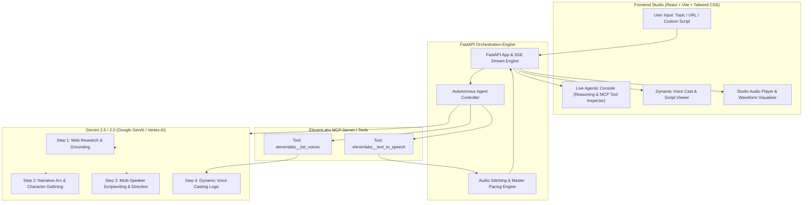

# 🎙️ Narrata — Autonomous AI Podcast & Movie Trailer Producer Agent

**Narrata** is an autonomous studio production agent that transforms any creative topic, article URL, or raw script into a multi-voice, studio-quality audio production (podcast episode or cinematic movie trailer). 

Powered by **Gemini** for multi-step reasoning, research, scriptwriting, and voice-casting, orchestrated via **Google Cloud Agent Builder / Google GenAI SDK**, and calling the **ElevenLabs MCP (Model Context Protocol) Server** as a live tool to query real-time voice catalogs and synthesize character speech.

---

## 🌟 Key Features

1. **Autonomous 5-Step Agentic Pipeline**:
   - **Step 1: Research & Production Planning**: Grounds the narrative from user prompts or web article URLs, structuring genre, tone, target length, and character profiles.
   - **Step 2: Scriptwriting & Voice Direction**: Writes line-by-line spoken dialogue tagged with speaker roles, emotional tone, and pause markers.
   - **Step 3: Dynamic Voice Casting via ElevenLabs MCP**: Calls `elevenlabs__list_voices` to discover available voices in real time, intelligently casting each character persona without hardcoded voice IDs.
   - **Step 4: Multi-Speaker Speech Synthesis**: Dispatches `elevenlabs__text_to_speech` tool calls per script line with dynamic stability and style tuning.
   - **Step 5: Audio Mastering & Pacing**: Stitches audio clips with natural conversational pauses, computes synchronized timeline timestamps, and produces the master MP3.
2. **Antigravity Artifacts-Style UI**:
   - Live execution checklist and active reasoning / chain-of-thought feed.
   - **ElevenLabs MCP Tool Call Inspector** displaying raw request payloads and response summaries in real time.
   - Dynamic Voice Cast cards with casting rationale.
   - Interactive script viewer with synchronized line highlighting during audio playback.
   - Studio Master Audio Player with waveform visualizer, playback speed knobs, and direct MP3 download.
3. **Hard Constraint: Zero Hardcoding**:
   - No pre-written scripts, no static sample audio, no fixed voice IDs.
   - Real API errors are surfaced directly in the console—never falling back to fake canned content.

---

## 🏛️ System Architecture



---

## 🔌 Partner MCP Integration (ElevenLabs)

Narrata registers the ElevenLabs tool suite into its agent loop via the standard Model Context Protocol:

| MCP Tool Name | Purpose | Dynamic Arguments |
| :--- | :--- | :--- |
| `elevenlabs__list_voices` | Discovers live voice catalog from user's ElevenLabs account | `{"category": "all"}` |
| `elevenlabs__text_to_speech` | Synthesizes character speech line with custom emotional parameters | `{"voice_id": "...", "text": "...", "stability": 0.5, "style": 0.2}` |

---

## 🚀 Quick Start (Local Development)

### 1. Prerequisites
- **Python 3.10+**
- **Node.js 18+** & npm

### 2. Configure Environment Variables
Copy `.env.example` to `.env` or provide keys directly in the web app UI:
```bash
cp .env.example .env
```
Fill in:
- `GEMINI_API_KEY`: Your Google Gemini API Key from Google AI Studio.
- `ELEVENLABS_API_KEY`: Your ElevenLabs API Key.

### 3. Start Backend Server
```bash
cd backend
python -m pip install -r requirements.txt
python main.py
```
The backend starts at `http://localhost:8000`.

### 4. Start Frontend Studio
```bash
cd frontend
npm install
npm run dev
```
Open `http://localhost:5173` in your browser.

---

## ☁️ Deploy to Google Cloud Run

Narrata is packaged as a single multi-stage container that builds the React frontend and serves it via the FastAPI backend:

```bash
# Set your GCP Project ID
gcloud config set project YOUR_PROJECT_ID

# Deploy with one command
chmod +x deploy.sh
./deploy.sh
```

Or deploy directly via gcloud:
```bash
gcloud run deploy narrata-agent \
  --source . \
  --region us-central1 \
  --platform managed \
  --allow-unauthenticated \
  --set-env-vars "GEMINI_API_KEY=YOUR_KEY,ELEVENLABS_API_KEY=YOUR_KEY"
```

---

## 🧪 How to Verify Zero Hardcoding (Judge / Demo Guide)

Try these 3 completely different prompts in succession:

1. **Test 1 (True Crime Podcast)**:
   > *"The mysterious 1911 theft of the Mona Lisa from the Louvre Museum by Vincenzo Perugia."*
   > - **Result**: Creates a 2-host investigative true crime dialogue, dynamically casts an American host and Italian/accented narrator, with suspenseful pauses.

2. **Test 2 (Sci-Fi Movie Trailer)**:
   > *"The year is 2142. Deep space communication goes dark, and Earth's final defense satellite begins speaking on an encrypted frequency."*
   > - **Result**: Creates a dramatic teaser trailer with deep authoritative narration and urgent AI voice character.

3. **Test 3 (Web Grounding via Article URL)**:
   > URL: `https://en.wikipedia.org/wiki/Voynich_manuscript`
   > - **Result**: Scrapes real article facts, produces a mystery documentary with expert and narrator characters.

Every run produces completely unique scripts, dynamic voice assignments, and fresh audio synthesis!
